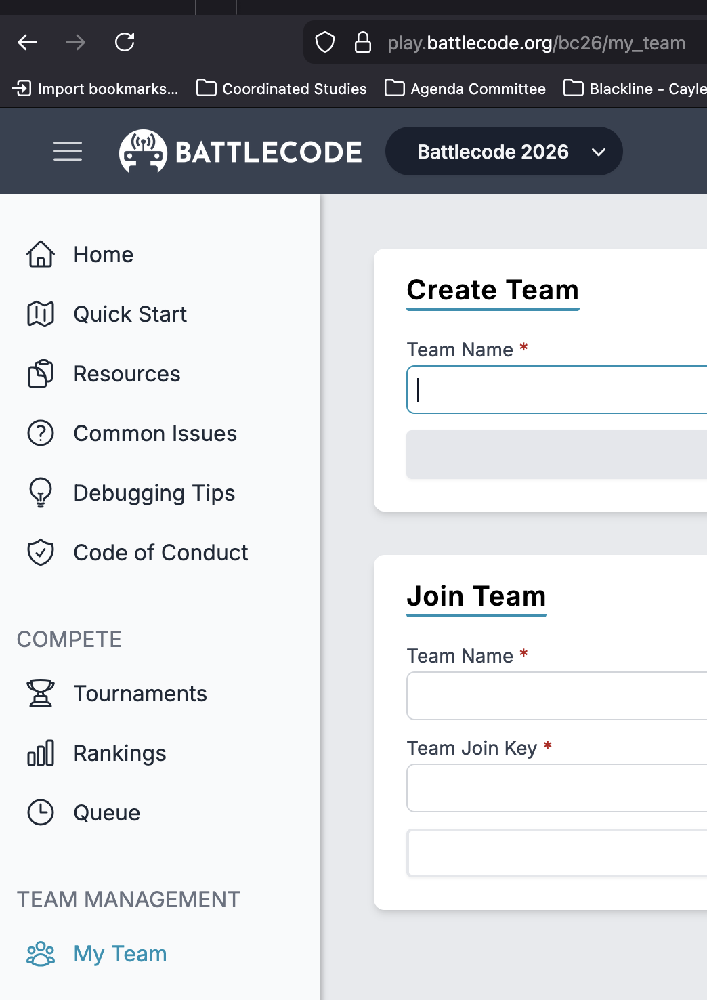

# Week 02a
2026-01-13 Tuesday

## First Half

Review:
* Introduction activity: strategy for games described as an English sentence
* Canvas Discussion boards for questions
* [Homework 01 released](../homeworks/HW-01.md), due in one week (Thursday, Jan 15) 
* [Syllabus](./Syllabus.md), and evaluation sentences


### Java Review

#### Java Class Structure

What is a Java program?

(Single-Threaded Version, which is How Each Battlecode Bot is Run)
A collection of classes, with methods (functions) that are run, in order, from start to finish, unless.

Like a karaoke song, program execution steps through line-by-line of the source code, but occasionally can jump to a different line of source code.
### Four Kinds of Java Statements

Four kinds of statements
* An assignment. `Type LHS = RHS`
* A function call `funcName(funcArg1, funcArg2, ...)`
* Flow control `if-else, while, for, switch, ...`
* Class / function definition `class Foo {`, `void run() {`

Three of them result in bytecode when compiled down

Two of them result in a *different* statement running than the one that comes next, in-order of the source code.

### Java Program 

From page 5, Chapter 1, of Head First Java, we will classify each of these statements into one of the four types. 

We'll choose one driver, and one navigator, and rotate until we've taken turns typing this via Zoom remote control

public static void main(String[] args) {


![[java-prog-1.png]]
}

## Break


## Second Half

### Forming Battlecode Teams

It's now time to form teams, based on what you know about your classmates, or you can ask the instructor to match you up with someone. Use Zoom chat direct message or Canvas messaging, to coordinate the following with your chosen teammate.

Register at play.battlecode.org, use your Evergreen email address.
Respond to any email verification. One of your should create a team, get a join key, and the other(s) should join the team using that key.



### In-class Pair Programming Activity

Jot down answers to these review questions, you'll submit them at the end of class.
* Review:
	* What are the two roles in pair programming?
	* How can computers are you looking at in pair programming?
	* *When* should you switch roles or end the session? List at least two different conditions.
	* *How* should you switch roles? List at least two different actions before switching roles can happen.


In your new teams, you'll join a breakout room,
* continue working on your Software Setup
* add the methods and code from this document below
* compile, and run it.

Choose one of you to be the driver, who will share their screen,
and the other will be the navigator, who will read from the document links above to help guide you.

### Navigator

In the file `java/src/week02a/RobotPlayer.java`, narrate to your driver to type the following, using the vocab words we've learned so far:
* The four types of Java statements: assignment, flow-control, function call, definitions
```
public static void run(RobotController rc) {

     while (true) {

        if (rc.getType().isRatKingType()) {

            runRatKing(rc);
		}
	}
}

public static void moveRandom(RobotController rc) throws GameActionException {

	MapLocation forwardLoc = rc.adjacentLocation(rc.getDirection());

	if (rc.canMoveForward()) {

		rc.moveForward();

	} else {

		Direction random = directions[rand.nextInt(directions.length)];


	if (rc.canTurn()) {

		rc.turn(random);

	}

}

public static void runRatKing(RobotController rc) throws GameActionException {

	int currentCost = rc.getCurrentRatCost();
	
	MapLocation[] potentialSpawnLocations 
	rc.getAllLocationsWithinRadiusSquared(rc.getLocation(), 8);

	boolean spawn = currentCost <= 10 || rc.getAllCheese() > currentCost + 2500;

	for (MapLocation loc : potentialSpawnLocations) {

		if (spawn && rc.canBuildRat(loc)) {
			rc.buildRat(loc);
			break;

		}

		if (rc.canPickUpCheese(loc)) {
			rc.pickUpCheese(loc);
			break;
		}

	}

	moveRandom(rc);
}
```

Compile it

```
./gradlew build
```
and run it in your Battlecode Client.

We'll come back to the main room to debrief before returning to breakout rooms.

### Next Time

Do Homework 01, due Thursday at 5pm. Watch for Homework 02 coming out, where you will
* watch the Battlecode lecture on Botmaking, focus on cheese mining.
* draw another picture in your notes
